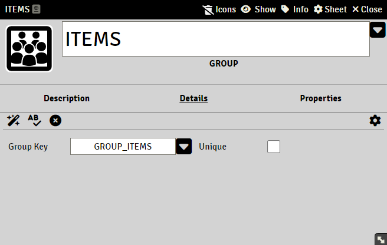
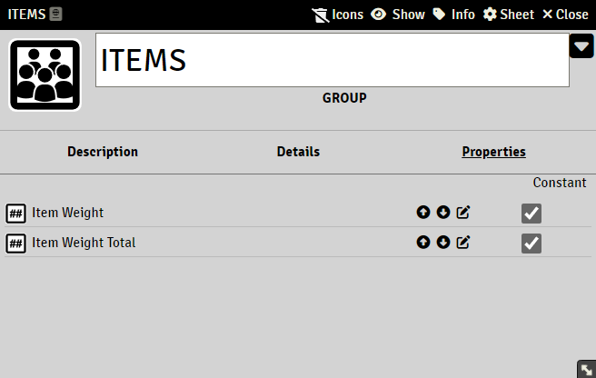

# Groups

> These pages are under construction, if needed, please refer to the previous [README](readme_previous.md)

A Group is a set of properties that can be assigned to a cItem.

In order to display a cItem in a table, the cItem must have at least one Group

### Details

##### Group key

Required field.
See [Keys in Sandbox](sandbox_keys.md)

### Data Type

##### Unique

Checking this will force the actor to only have one cItem of this group regardless how many cItems are added to the actor

### Properties

Add properties by dragging them to the group

##### Constant

Group properties with Constant checked will not be editable or calculated on the actor, only before on the cItem
