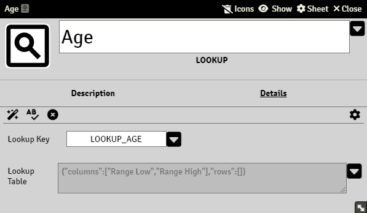
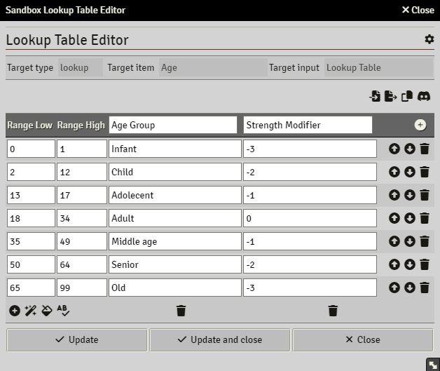
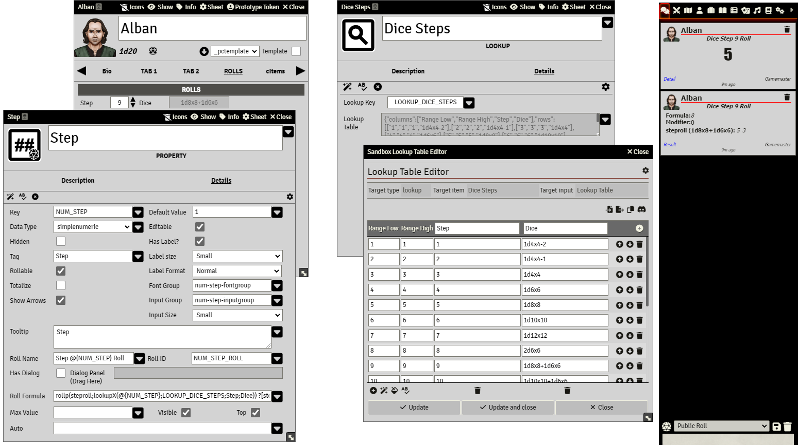

# Lookup

The Lookup item makes it possible to store tables with data and query that data in a Expression



## Attributes

### Lookup Key

Required field.
See [Keys in Sandbox](sandbox_keys.md)

### Lookup Table

A JSON-string with table data.
Edit this with the Table Editor(use the Item Helper)

## Lookup Table Editor



### Functions

#### Autogenerate all ranges

This will overwrite all Low/High Range values with number starting at the first row´s Low Range to 1 and incremented by 1 for each row.

#### Autogenerate empty ranges

This will overwrite all empty Low/High Range values with numbers based on previous availably number incremented with a weight of 1.

#### Import table

Imports a semi-comma(;) separated (CSV) file. This will overwrite the current table.

File example
```
Range Low;Range High;Age Group;Strength Modifier
0;1;Infant;-3
2;12;Child;-2
13;17;Adolecent;-1
18;34;Adult;0
35;49;Middle age;-1
50;64;Senior;-2
65;99;Old;-3
```

#### Export table

Exports current table to a semicomma(;) separated (CSV) file.

## Lookup Expression Functions

To be used in Auto fields, Roll expressions etc.

### lookupV

Attempts to find the row in a lookup table where the lookup value matches the Low/High Range and returns the value of the returnColumn for that row.

##### Syntax

```
lookupV(lookupValue;lookupKey;returnColumn;exactMatch=false;defaultReturn='') 
```

##### Arguments

###### lookupValue(string)

The value to compare with the table´s Low and High Range

###### lookupKey(string)

The key of the lookup

###### returnColumn(number or string)

Which column to take the returned value from
If `returnColumn` is a string, the function will try to find the string in the lookups column

###### exactMatch

Optional argument, default is `false`
When set to false, if the value is not found, if `lookupValue` is higher than the highest available, it will return the value on the highest row. If `lookupValue` is lower than the lowest available, it will return the value on the lowest row,
When set to `true`, the lookup must find the exact value, if not found, `defaultReturn` is returned.

###### defaultReturn

Optional argument, default is empty string

##### Returns

Returns the found value in the lookups table for column `returnColumn`  where the `lookupValue>=Range Low and lookupValue<=Range High`
Returns `defaultReturn` string if error or not found.

##### Examples

```
// Note, comments are not supported in the Expression Editor

lookupV(49;LOOKUP_AGE;2) // returns "Middle Age"
lookupV(49;LOOKUP_AGE;Age Group) // returns "Middle Age"
lookupV(100;LOOKUP_AGE;Age Group) // returns "Old"
lookupV(100;LOOKUP_AGE;Age Group;true) // returns ""
lookupV(-1;LOOKUP_AGE;Age Group) // returns "Infant"
lookupV(-1;LOOKUP_AGE;Age Group;true) // returns ""
lookupV(-1;LOOKUP_AGE;Age Group;true;Unknown) // returns "Unknown"

// If actor property NUM_AGE=34
lookupV(@{NUM_AGE};LOOKUP_AGE;Age Group) // returns "Adult"

// Nested lookupVs are supported upto three levels
// If actor properties NUM_AGE=34  SELECTED_LOOKUP="AGE" SELECTED_COL=10
lookupV(@{NUM_AGE};LOOKUP_@{SELECTED_LOOKUP};lookupV(@{SELECTED_CO};LOOKUP_AGE_CATEGORIES;2)}) // returns "Adult"

```

### lookupX

Attempts to find the row in a lookup table where the lookup value matches exact the  value in the  lookup column matches  and returns the value of the returnColumn for that row.

##### Syntax

```
lookupX(lookupValue;lookupKey;lookupColumn;returnColumn;defaultReturn='') 
```

##### Arguments

###### lookupValue(string)

The value to find

###### lookupKey(string)

The key of the lookup

###### lookupColumn(number or string)

Which column to take the returned value from
If `lookupColumn` is a string, the function will try to find the string in the lookups column

###### returnColumn(number or string)

Which column to take the returned value from
If `returnColumn` is a string, the function will try to find the string in the lookups column

###### defaultReturn

Optional argument, default is empty string

#### Returns

Returns the value in the `returnColumn` for the matching row
Returns `defaultReturn` string if error or not found.

#### Examples

```
// Note, comments are not supported in the Expression Editor

// if actor property TXT_AGE_GROUP="Child"
lookupX(@{TXT_AGE_GROUP};LOOKUP_AGE;2;3) // returns -2
lookupX(@{TXT_AGE_GROUP};LOOKUP_AGE;Age Group;Strength Modifier) // returns -2
```

### lookupList

Returns a character separated string with all values for a column.
Useful in LIST properties Option Auto.

##### Syntax

```
lookupList(lookupKey;returnColumn;strSeparator='|')
```

##### Arguments

###### lookupKey(string)

The key of the lookup

###### returnColumn(number or string)

Which column to take the returned values from
If `returnColumn` is a string, the function will try to find the string in the lookups column

##### strSeparator

Optional argument, default is pipe(|)

##### Returns

Returns string separated by strseparator

#### Examples

```
// Note, comments are not supported in the Expression Editor

lookupList(LOOKUP_AGE;Age Group) // returns "Infant|Child|Adolecent|Adult|Middle age|Senior|Old"
```

## Example of lookup in roll



Roll Formula in simplenumeric property Step

`rollp(steproll;lookupX(@{NUM_STEP};LOOKUP_DICE_STEPS;Step;Dice)) ?[steproll.total]`

Auto in simplenumeric property Dice

`lookupX(@{NUM_STEP};LOOKUP_DICE_STEPS;Step;Dice)`
