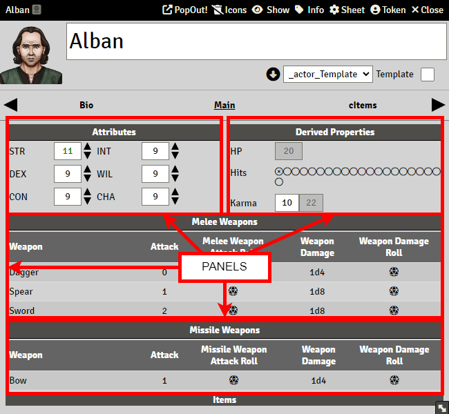
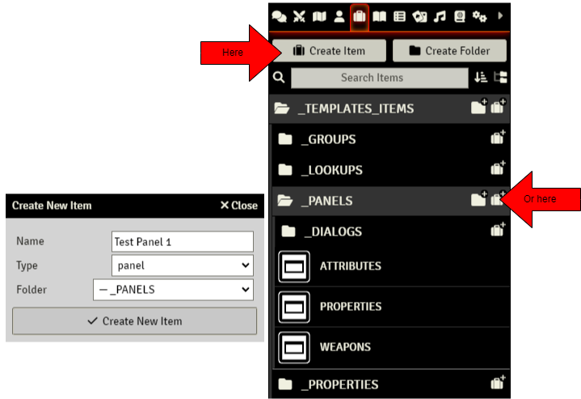
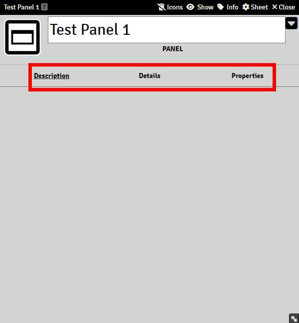
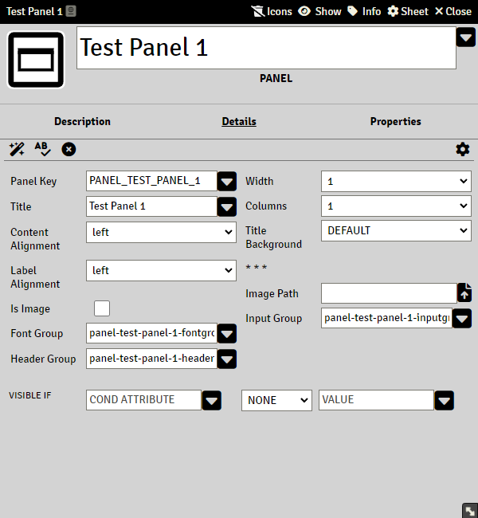
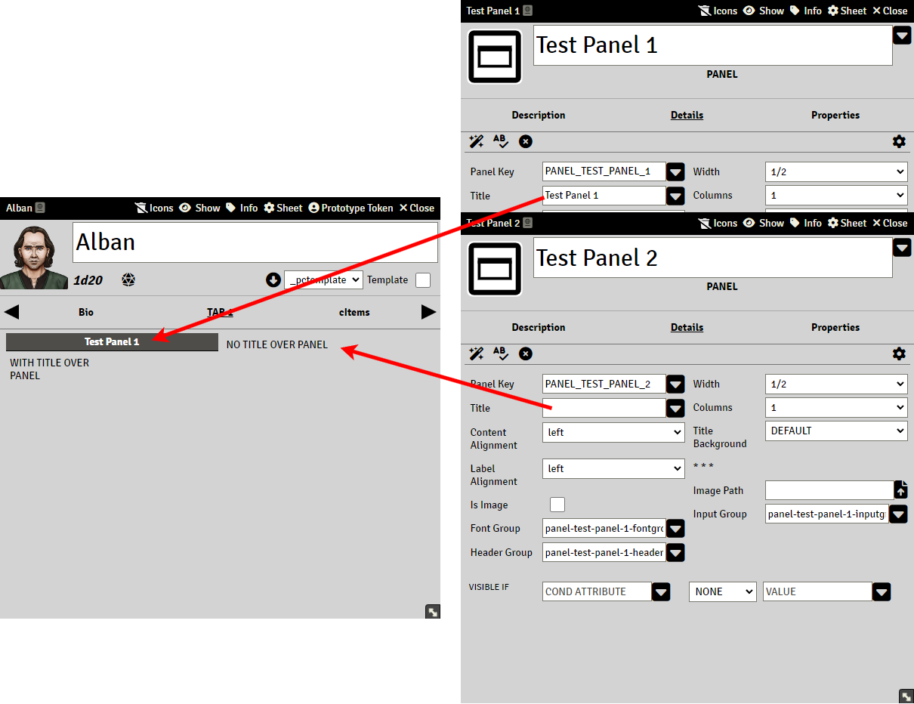
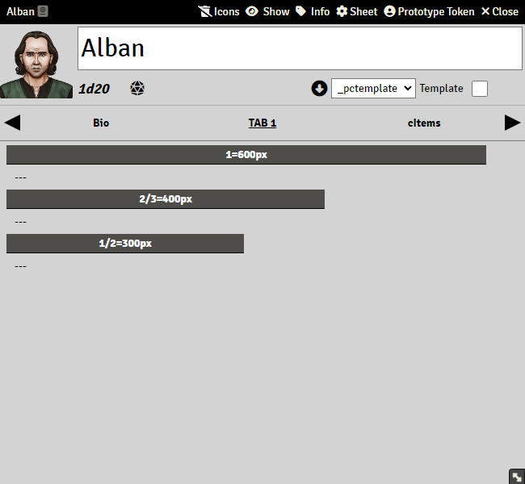
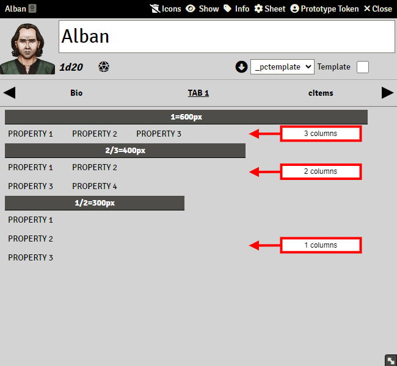
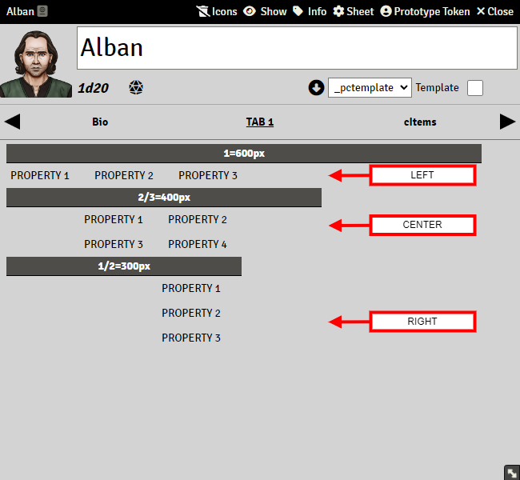

# Panels

> These pages are under construction, if needed, please refer to the previous [README](readme_previous.md)

Panels are elements that hold Properties, and are contained in Tabs. They are very important for sheet layout purposes:

Creating a Panel is very simple. Just press the "Create Item" Button and select "panel" from the list. Name it, and create it.

A new panel has three submenus: Description, Details, and Properties

#### Description menu

In this page you can add an informative description or summary of what the panel contains or includes. It is optional to do this, and does not interfere with the functioning of the element.

#### Details menu

This page contains a number of input fields that configures how the panel works.

##### Panel Key

Required field, it has to be filled for every panel, and it needs to be unique. If two or more panels share the same key, then the template will not rebuild correctly and the system will throw many errors. A key is a word or a group of characters, without spaces/blanks in between. i.e: panel_one, panel_1, inventorypanel, my-panel-3, etc. See [Keys][sandbox_keys.md]

##### Title Key

Unlike tabs, this is not a required field. Any panel without a title will not display a row with the title over the panel:

##### Width

This field lets you choose the width of the panel, as being a fraction of a 600px element. For example, if you choose "1" as Width, the panel will have a width of 600px, and if you choose "1/2" its width will be 300px.

Note. To use resizable panels, set option "Enable resizable panels" in [Settings](sandbox_settings.md)

##### Columns

This field sets the number of properties that each row will display within the panel:

##### Content Alignment

It defines how will the different properties will align inside the panel, to the left, center or to the right:

##### Is Image and Image Path

If checked, and a path to an image is introduced, an image will be displayed at the bottom of the panel.

##### Font Group

If a CSS class name is introduced here, every label or property tag within the panel will inherit this style.

##### Input Group

If a CSS class name is introduced here, every input field within the panel will inherit this style.

##### Head Group

If a CSS class name is introduced here, the panel head title will inherit this style.

##### Visible If

Makes the panel visible depending on the value of an actor property. It works in exactly the same way as explained in [Tabs](https://gitlab.com/rolnl/sandbox-system-builder/-/wikis/Tabs)

##### Properties menu

You can drag and drop to this menu any properties you might one included in the panel.
