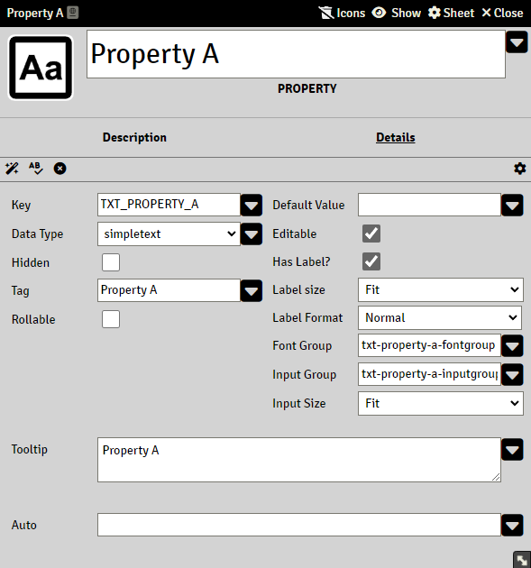
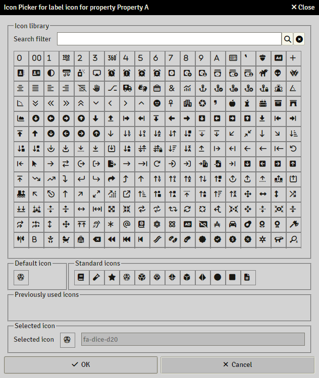

# Properties

> These pages are under construction, if needed, please refer to the previous [README](readme_previous.md)

Properties are items that define how the information of an actor will be stored. They basically generate the input fields inside the actor panels. 

## Common attributes of properties

Most properties have a common set of attributes

### Key

Required field.
See [Keys in Sandbox](sandbox_keys.md)

### Data Type

Available data types are 

- [SimpleText](property_simpletext.md)
- [SimpleNumeric](property_simplenumeric.md)
- [Checkbox](property_checkbox.md)
- [Radio](property_radio.md)
- [Textarea](property_textarea.md)
- [List](property_list.md)
- [Label](property_label.md)
- [Badge](property_badge.md)
- [Table](property_table.md)
- [Button](property_button.md)

### Hidden

Hides the property on the sheet

### Tag/Title

The text to display as a label on the sheet

### Rollable

Enable Rolls for this property.  For more information, see [Rollable Properties](properties_rollable.md)

### Default Value

This is the initial value that the property will have in the actor. A empty field for numerical properties means 0.

This field accepts [Expressions](sandbox_expressions.md)

### Editable

Makes a property read only for players

### Has Label?

If enabled, a label are displayed next to the input on the sheet, else only the input will be shown.

### Label Size

The width of the label for this property.

### Label Format

The format of the displayed label.

- Normal

- Bold

- Small

- Die

  Will display a D20 icon

- Icon

  Enables Icon Picker to select a custom icon for display as label

  

### Font Group

What CSS class will be added to the label element. See [CSS and styling](css_and_styling.md) 

### Input Group

What CSS class will be added to the input element. See [CSS and styling](css_and_styling.md) 

### Input Size

The width of the input.

### Tooltip

Text to display as tooltip for the property

## Item Helpers

Next to most attributes are a down arrow that drops down that attributes Item Helpers.

What Item Helpers that are available depends the attribute.