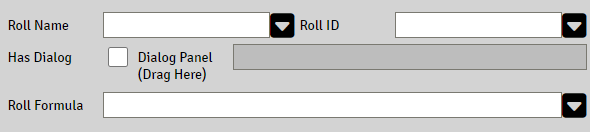

# Rollable Properties

A property that has the attribute `Rollable` enabled displays an additional panel to configure the roll to be triggered by clicking the property's label.

### Roll Name

The text to present as title in the rolled chat message.
This field accepts [Expressions](sandbox_expressions.md)

### Roll ID

This is the main roll ID, an identifier or Key that the roll will belong to. It does not have to be unique, so if your system has a lot of skills and this is a roll for one of them, you just can use "skill" as roll ID. 

This ID can be used by a cItem MOD to modify the roll, see [cItems](citems.md)

### Has Dialogs

To enable Roll Dialog for this roll, check the `Has Dialog` 

#### Add dialog to roll expression

Drag and drop the dialog panel to the property.

Use the dialog panels property  as  `d{dialog_property}`in the Roll Formula, see [Roll Dialogs](roll_dialogs.md)

### Roll Formula

A valid [Roll Expression](roll_expressions.md)

