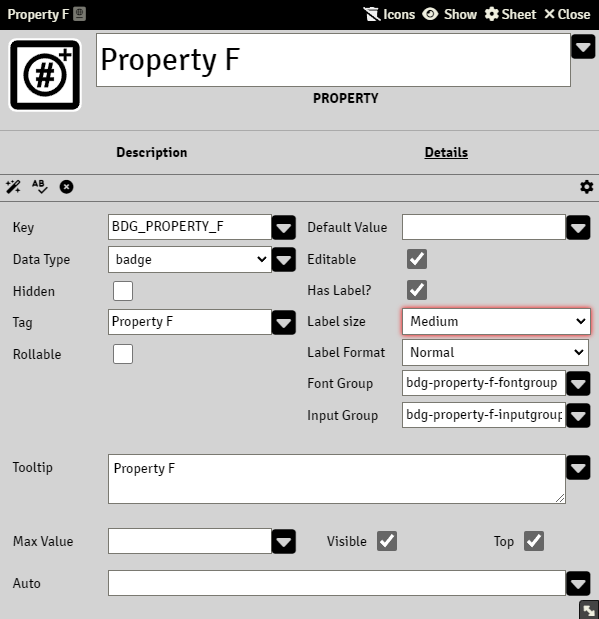

# Property Badge

Badge is a special variant of a number property, it stores only whole numbers(integer)

### Max Value

The maximum value that the property can have. This field accepts [Expressions](sandbox_expressions.md)

### Auto

A valid Common Expression, see [Expressions](sandbox_expressions.md)

A property with an Auto will rendered as read-only.