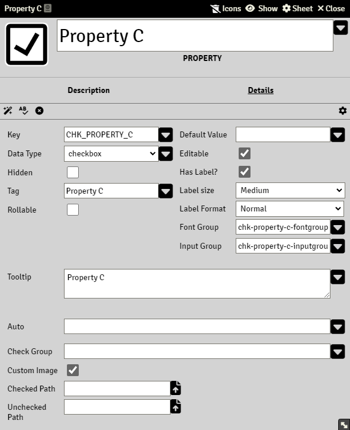

# Property Checkbox

Data stored in this property is Boolean and contain either `true` or `false`.

Note that `true` is also synonymously with `1` and `false` with `0`  when used in calculations.

### Auto

A valid Common Expression, see [Expressions](sandbox_expressions.md)

A property with an Auto will rendered as read-only.