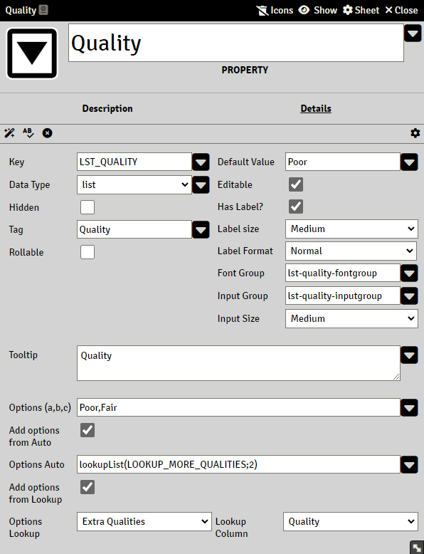

# List Property

The List property generates a dropdown list with options for the user to select from.



## Specific Attributes

### Options

A comma separated string

Separate the options you want displayed in the dropdown list box by commas.
Whitespaces may be inside each option but never around an option

Good example

```
Poor,Fair,Good,Very good,Excellent
```

Bad example with extra white spaces

```
Poor, Fair,Good,Very good ,Excellent
```

Good example  with empty string at top of list

```
,Poor,Fair,Good,Very good,Excellent
```

### Add options from Auto

Enable to add additional options from an Expression. 

### Options Auto

The Expression must return a comma(or pipe '|') separated string. See [Lookups](lookups.md)

### Add options from Lookup

Enable to add additional options from a Lookup item

### Options Lookup

Lists all currently available Lookup items

### Lookup Column

Lists all columns in currently selected Lookup item

## A note on options

The LIST dropdown is built by the following order

1. Add options from string in the Options field
2. Add options from Expression in Options Auto
3. Add options from the lookup in Options Lookup

Meaning each step add options to the final dropdown, and any combination of these works.

