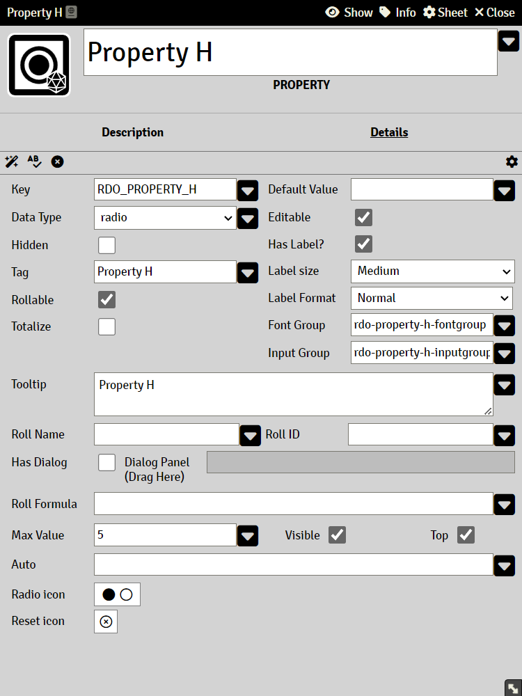

# Property Radio

Data stored in this property is integer numbers and can only contain whole numbers.

### Max Value

The maximum value that the property can have. This field accepts [Expressions](sandbox_expressions.md)

It sets the maximum number of radio buttons to be displayed.

For RADIO properties, this can not be empty.

### Auto

A valid Common Expression, see [Expressions](sandbox_expressions.md)

A property with an Auto will rendered as read-only.

### Radio icon

Displays the on/off icon to be shown for each radio element

Clicking this opens the Icon Picker. 

### Reset icon

Displays the reset icon to be shown for the radio group

Clicking this opens the Icon Picker. 
