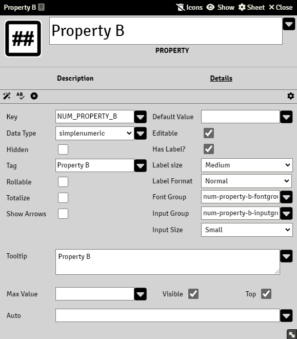

# SimpleNumeric Property

Data stored in this property is integer numbers and can only contain whole numbers.

### Totalize

Group properties with Totalize enabled will keep track on the total number added for each property. See [Tables](property_table.md)

### Arrows

It will display up and down arrows for simplenumeric properties, as a tool to modify their value

### Max Value

The maximum value that the property can have. This field accepts [Expressions](sandbox_expressions.md)

Filling this input field would display a box with the max value on the right side of the input. For example, if we create a property called Hit Points (HP, PG in Spanish) and set Max Value as 10 and Default Value as 10:

### Visible

If enabled, a input will be added to the actor sheet next to the property value field

### Auto

A valid Common Expression, see [Expressions](sandbox_expressions.md)

A property with an Auto will rendered as read-only.