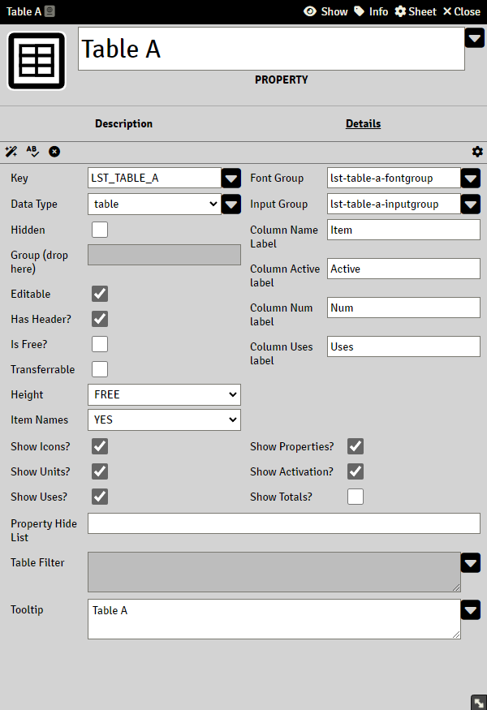

# Table Property

> These pages are under construction, if needed, please refer to the previous [README](readme_previous.md)

Table is a special property type and comes in two flavors,

- Standard Tables
- Free Tables

## Standard Table

A standard table will display all cItems inside an Actor of a specific group. The table will display each property of the group as a column (if said property is not Hidden).

## Free Tables

Free tables are a quick way to get a table on the actor sheets without having to create any cItems.

## Table totals

To get the total of a table, use `@{tableKey.totals.citemKey}`