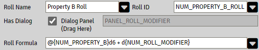
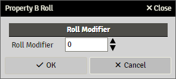
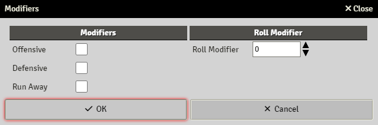
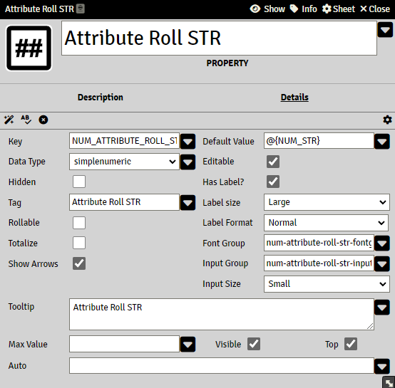
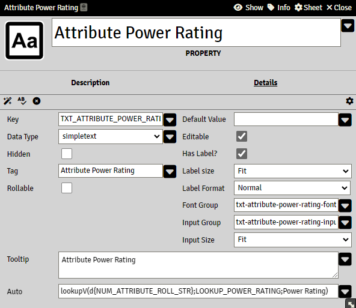

# Roll Dialogs

When using a dialog panel in a roll expression, the user gets presented with a dialog for input before the roll is executed.

If the user clicks **Cancel** in this dialog the roll is cancelled.

Note that changing any values in a dialog will not be updated to the original actor/cItem, they are only used in the roll.

The properties in the dialog can be used in the roll expression as any other property and are accessed with the following format

```
d{dialog_property_key}
```

The title of the dialog is set by the rolls Roll Name(which accepts an [Expression](sandbox_expressions.md))

##### Example.





The dialog panel can be a multi-panel with panels inside as well

##### Example.



### Create Roll Dialog

The roll dialog is built on a Panel or a Multipanel with Panels inside.

To create a panel for dialog, this is done as any normal panel with properties etc. except it is not added to the actor template.

#### Supported properties datatypes for dialogs

- Simpletext
- Simplenumeric
- Checkbox
- List

#### Loading actor/citem data into dialog

To load any values from an actor, use the property´s **Default Value** field(which accepts an [Expression](sandbox_expressions.md) that can reference an actor property `@{..}`or a cItem property `#{..}` or any valid expression).

##### Example



A dialog property can also be calculated using the **Auto** field. Such a property will be re-calculated on changes when the dialog is displayed.

To use the dialogs current values, use `d{..}` in the expression

##### Example


