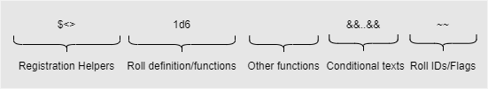
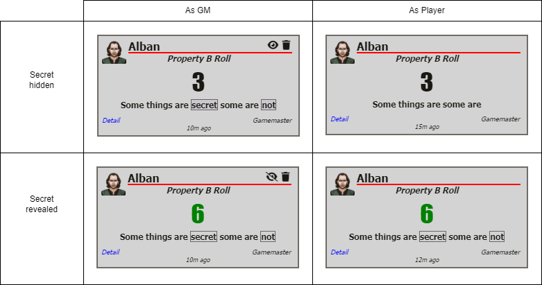

# Roll Expressions

> These pages are under construction, if needed, please refer to the previous [README](readme_previous.md)

Rolls can be defined for Properties and cItems, if some requirements are met:
- Properties: a property will trigger a dice roll when its label is clicked on the character sheet, only if the property option "Rollable" is checked. When checked, a Property item will display the roll options menu (see below).
- cItems: all cItems types except PASSIVE accept rolls. When a cItem activation checkbox or icon is clicked on a character sheet, a roll will be triggered.

**Roll options menu**

Both Properties and cItems have a section where you can configure how the roll will be triggered. See [Rollable Properties](properties_rollable.md)

## Roll Expression Structure

All rolls need to follow this structure



Minimum required is a number/roll definition that returns a number.

Example

```
$<1;1d6> 3d6+$1 &&total;1:FAIL,3:SUCCESS&& ~testroll~
```

ALSO IMPORTANT: Rolls in sandbox only return numerical values! Always make sure that the result of your roll is a number!!! **AND ONLY ONE NUMBER** So you can't return: "Hello World", or [3,4,6], or "SUCCESS". It needs to be a number, only one, like 4.

## Registration Helpers

`$<index;expression>`: So roll parsing is not perfect, and until we find a way to do it more visually attractive there will be tons of problems. Expressions that contain brackets inside other expressions that also contain brackets will give you troubles. To avoid this, you can save pieces of your expression through this function. For example `$<1;%[@{str},0:0,15:1]>` will register the expresion after the semicolon as $1. A full example of this is: `$<1;%[@{str},0:0,15:1]> 2d6+$1`. This expression is equivalent to `2d6 + %[@{str},0:0,15:1]`. Remember to change the number before the semicolon, as is the index and will let you identify subexpressions using $1,$2,$3, etc.

Using Registration Helpers are a great way to hide information about a roll(or any contributing property values) from players.

## Roll definition/functions

Roll definitions can be as simple as a string with `1d20` to using a function call like rollp().

### roll()

#### Syntax

```
roll(Name;dice;faces;explodes)
```

If you want to have a roll separated from your roll expression with a name, and displayed by its own, you use this formula. For example, imagine that for a system we are designing we need to roll 1d6 in every skill check, and this die is called the "Anger Die". You could set it up like this. For example `roll(Anger;1;6;false)` registers a roll named Anger, of 1 dice of 6 faces and doesnt explode; This expression substitutes `!(Roll Name;Roll Expression)`, that is removed from the system. Also ¬¬ expression doesn't work anymore. The last argument, "explodes", can be either false, true, or add. If it is add, the succesive exploded dice will be added instead of displayed as independent dice. For example, `roll(Anger;1;4;true)` might return 4,4,3 while `roll(Anger;1;4;add)` might return 11.

`?[Roll Name]`: returns the reference of a registered roll, as many times as you want. You need to use this with one of the following.

### rollp()

#### Syntax

```
rollp(name;dice_expression;optional_roll_IDs)
```

`rollp()` functions in a very similar way to `roll()`. It was written for cases such as having simpletext properties with a value of "1d6" (a dice expression) not being able to be put into `roll(name;dice_number;sides;explodes?)` because the parameters for number and faces had to be split, and `roll()` doesn't support dice modifiers like "kh" or "cs".

Any valid Foundry dice formula should work with rollp() and is the recommended roll definition to use.

The documentation for it as follows: `rollp(name;dice_expression)` or `rollp(name;dice_expression;optional_roll_IDs)` and is referenced via `?[name]` just like roll() is. BUT has a new way via `?[name.total]` which gives a final singular value. The optional_roll_IDs are separated by commas, and allows any citems with ROLL mods to affect the roll/value contained in that specific rollp() call.

There are also two new dice modifiers, `im` or `im#` (where # is a number like `im6`) for "imploding" dice.  Implosions happen only ONCE and if a number is specified, it implodes on that number or lower. example: `1d10im3` Implodes once if result of the 1d10 is 3 or less. Implosions are like exploding dice; they subtract from the final amount instead of add (Cyberpunk systems use this).

`xa` is another one, "Explode Add" which only matter for Sandbox purposes, it turns an exploding dice into 1 value "internally" (pretty advanced, because you have to keep track of this yourself basically, and know exactly how it works) but `rollp(name;2d6xa)` rolls 2d6 ... 6,3 (explodes) -> 6,3,4 ---> which "internally" turns into 10,3 when referencing ?[name]

Now, for some more context and examples. rollp loosely stands for "rollParsed" because it has the ability to fully parse a roll expression. I will try to keep the example as simple as possible. The primary benefit of rollp() is being quite a bit easier to use than roll() and accepting any kind of Foundry support dice modifiers and expressions (as well as Sandbox ones!). Another cool benefit is being able to saved "parsed" variables. the `$<#;..>` syntax does this, but does not "parse" its contents, only find-and replace. `rollp(dice;1d6+1d4+2)` will return the dice-result-array for the 1d6 AND 1d4 with `?[dice]`! `?[dice]` might be `3,4` and `?[dice.total]` would be `9`, (3+4+2)

You can also nest things, please keep in mind this is a "made up" example, and you can achieve similar without using rollp(), but just to demonstrate: `rollp(dicePool;5d6) rollp(parsePool;{?[dicePool]}dh2) rollp(final;{?[parsePool]}kh2) ?[final.total]` Roll 5d6, drop the highest 2, then keep the highest 2 of the remaining pool. At least I think this should work 🤠 it does allow for more complicated formulas, but there are still limitations and restrictions to it.

## Built-in system properties

These properties are already defined and can be used in a roll expression

- `#{diff}` - returns current Difficulty Class, see [Sandbox User Interface](sandbox_user_interface.md)

- `@{name}` - returns current actor name

- `#{targetname}` - returns the name of the first targeted token

- `#{targetlist}` - returns a comma separated string of all targeted tokens name

- `#{target|target_attribute_key}`: Returns the value of an attribute of the target actor on the map. Useful for calculating AC and such. Example: 

  ```
  1d20 + @{weapon_skill} &&total;0:FAILURE,#{target|ac}:YOU HIT!&&
  ```

### cItem Reserved keys

These are only valid with a cItem

- `#{name}` - the name of the cItem
- `#{num}` -  returns the current number of units of the cItems that this actor has.
- `#{active}` - the activation status of a ACTIVE cItem
- `#{uses}` - the current available uses of a CONSUMABLE cItem
- `#{maxuses}` - maximum number of uses for a CONSUMABLE cItem
- `#{roll}`: Returns the value of the latest roll executed on a cItem. How is this useful? Well, imagine you have a cItem that is a CONSUMABLE, and every time is activated it rolls 1d6. If you want that 1d6 result to be added to an attribute as part of an ADD MOD, you just need to use `#{roll}` in the MOD value input field.

## Other Functions

All Common [Expressions](sandbox_expressions.md) Functions can be used in a Roll.

#### add()

##### Syntax

```
add(property_key;value)
```

This expression will only work with a targeted token. It will add "value" to the current value of the specified property (key only, no @). For example, `roll(Damage_Roll;2;10;false) sum(?[Damage_Roll]) add(HP;-sum(?[Damage_Roll]))`. This example expression will subtract 2d10 from the property `@{HP}` of the targeted token.

#### addself()

##### Syntax

```
addself(property_key;value)
```

Like `add()` but works on the actor itself
Example.

```
rollp(dice;1d3)
?[dice.total]
%[?[dice.total],0:0,
 1:addself(NUM_DEXTERITY;1),
 2:addself(NUM_STRENGTH;1),
 3:addself(NUM_DEXTERITY;10) addself(NUM_STRENGTH;10) ]
&&?[dice.total];0:N/A,1:Adding 1 to Dexterity,2:Adding 1 to Strength,3:Adding 10 to both&&
```

#### set()

##### Syntax

```
set(property_key;value)
```

As `add()` property, but will set the value to it.

#### setself()

##### Syntax

```
setself(property_key;value)
```

As `set()` property, but will set the value to it.
Example

```
rollp(dice;1d2)
?[dice.total]
%[?[dice.total],0:0,1:setself(NUM_DEXTERITY;1),2:setself(NUM_STRENGTH;1)]
&&?[dice.total];0:N/A,1:Setting Dexterity to 1,2:Setting Strength to 1&&
```

#### table()

##### Syntax

```
table(name;exp)
```

Rolls on a rollable table. 

It has optional parameters, `table(name;exp)` where exp can be your own result or a different dice (if that table normally rolls a 1d10 by default, you can roll 1d6, or put just 7; for example)
To roll without any chat message use`0 table(roll_table) ~nochat~`

## Conditional texts

#### Syntax

```
&&value_to_compare;value_1:text_1,value_N:text_N&&
```

Conditional text. So imagine you want to return a sentence to the chat, along with your roll. You want to return "SUCCESS" if the result of your roll is over 8, "FAILURE" if the result of the roll is under 7, and "PARTIAL SUCCESS" on every other result. This function allows you to return that sentence/word below the roll result. So you can do this with the following formula `&&total;0:FAILURE,7:PARTIAL SUCCESS,9:SUCCESS&&`. The first argument of the expression is the value you are analyzing, and if you write `total` it will take into account the total of the roll. You can include a property instead of that, or another roll expression with a numeric outcome.

You can output a lot of information from the && expression of a Rollable Property. It is also possible to use more than one in the case that you need multiple different conditional outputs.

Example

```
1d20
&&0;0:This text always appears&&
&&total;20:This text only appears when the total is equal-to-or-greater-than 20&&
```

#### Always show conditional text

To always show a conditional text, you can use 

```
0 &&0;0:Show always this&&
```

#### Hiding the rolled result

You can also add `~noresult~` to the end of an expression to hide the result! PLEASE KEEP IN MIND. THE "ROLL" STILL NEEDS A VALUE TO SUBMIT TO CHAT! even if it ends up being hidden.

```plaintext
0
&&0;0:The result of '0' has been hidden! and only text appears!&& ~noresult~
```

#### GM Secrets in conditional texts

Also, if you want to hide parts of the conditional text for non-GMs, you can use the CSS-class `secret`

```
1d6 &&0;0:Some things are <span class="secret"> secret</span> some are <span class="secret"> not</span> &&
```

This will enable the Reveal/Hide icon on the chat message



#### Setting entire all conditional text to secret

All text in conditional(`&&...&&`) will be marked as `secret` if the roll flag `~secretconditional~` is used

Example.

```
0 &&total;0:Everything are secret&& ~secretconditional~
```

#### Formatting conditional texts

You may use HTML tags inside the && expression. Use of CSS classes is easiest, but you can also use style tags with some extra effort. You can use things like `<br> or <hr>` to better organize (or even more complicated DIV flexbox or grid things).

Example:

```plaintext
0
&&0;0:<hr><i>This text is italic and has a horizontal-rule</i>&&
```

```plaintext
0
&&0;0:<span class="roll-result">This text is big and bold</span>&&
```

Using CSS attributes in a && needs an extra step due to the parser have problems with `(),;:`. To overcome this, use HTML codes for those characters.

| Character |                   | HTML Code |
| --------- | ----------------- | --------- |
| ,         | comma             | `&#44`    |
| :         | colon             | `&#58`    |
| ;         | semi colon        | `&#59`    |
| (         | left parenthesis  | `&#40`    |
| )         | right parenthesis | `&#41`    |

##### Examples with HTML codes

```
0 &&0;0:<span style="font-size&#58 16px&#59 color&#58 red&#59">This text is big and red</span>&&
```

```plaintext
0 &&0;0:<hr><i>This&#44 (text) is&#58 italic&#59 <span style="font-size&#58 16px&#59 color &#58 rgba&#40 174 &#44 0 &#44 78 &#44 0.8 &#41&#59">@{NUM_STANDARD_ROLL}</span> and has  a horizontal-rule</i>&&  
```

Also, another option is to use Registration Helpers

```plaintext
$<30;style="color&#58darkred&#59">
$<31;style="color&#58darkgreen&#59">
$<32;style="color&#58grey&#59">
0
&&0;0:<hr><span $30>This text is Dark Red</span>&&
```

## Roll IDs

`~Roll_ID~`: adds a Roll ID to the roll. Remember that we have a MOD type called ROLL? And this one adds values to rolls of a specific Roll ID? So this function lets you add Roll IDs to rolls. As many as you like. So let's say we just defined a roll for an attack with Roll Name:"Attack", Roll ID: "attack", and Roll Expression: `1d20+@{strength}`. However, we want more definition for it, and for that we want to incorporate some more Roll IDs, in case we need to modify the roll through a MOD. Let's say we want to add the Ids "melee_attack" and "slashing", then we would have to change the Roll Expression to 

```
1d20+@{strength} ~melee_attack~ ~slashing~
```


## Roll Expressions flags
Flags can be added at the end of a roll expression, changing basic functionality of the roll.
All flags are used with surrounding tildes `~flag~`
| Flag                  | Description                                                  |
| --------------------- | ------------------------------------------------------------ |
| `~ADV~`               | For d20 rolls, gives advantage                               |
| `~DIS~`               | For d20 rolls, gives disadvantage                            |
| `~gm~`                | Changes the Roll Mode to Private GM                          |
| `~blind~`             | Changes the Roll Mode to Blind GM                            |
| `~self~`              | Changes the Roll Mode to Self Roll                           |
| `~init~`              | Sends the result of the roll to the initiative on the combat tracker |
| `~nochat~`            | No chat message is created                                   |
| `~noresult~`          | No result is shown in the created chat message               |
| `~secretconditional~` | All text in conditional(`&&...&&`) will be marked as `secret`<br />Example.<br />`0 &&total;0:Everything are secret&& ~secretconditional~` |

## Some examples of rolls

- Roll 1d6: 

  ```
  1d6
  ```
- Roll 1d6, if the result is lower than 4, return 0.Otherwise return 1: 

  ```
  %[1d6,0:0,5:1]
  ```
- Roll 2d6 exploding, one called Skill and the other Wild, and return the highest: 

  ```
  roll(Skill;1;6;true) roll(Wild;1;6;true) max(?[Skill],?[Wild])
  ```
- Roll 4d6 and count results higher than 4:   

  ```
  roll(Test;4;6;false) countH(?[Test];4)
  ```
- Roll 3d10, add the results, and if any die is equal to 10 add +5:  

  ```
  roll(Test;3;10;false) sum(?[Test]) + (countE(?[Test];10) *5)
  ```
- Roll 2d6, if any die is higher than 3 display SUCCESS, if the first die rolls a 1 display CONSEQUENCE, if both roll a 1 display SNAKE EYES:  

  ```
  roll(Test1;1;6;false) 
  roll(Test2;1;6;false) 
  max(?[Test1],?[Test2]) 
  &&max(?[Test1],?[Test2]);0:FAIL,4:SUCCESS&& 
  &&countE(?[Test1];1);0:-,1:CONSEQUENCE&& 
  &&countE(?[Test1],?[Test2];1);0:-,2:SNAKE EYES&&
  ```

  

