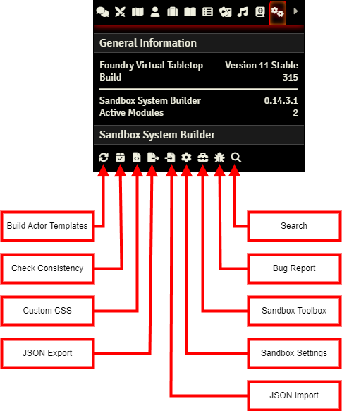
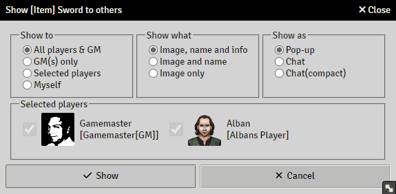
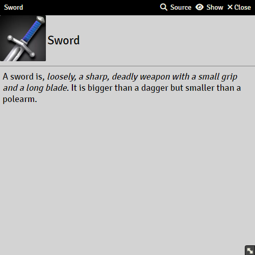
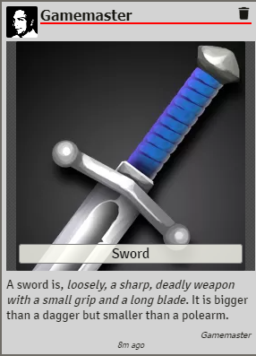
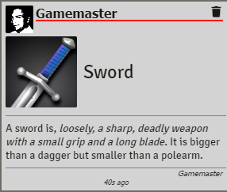
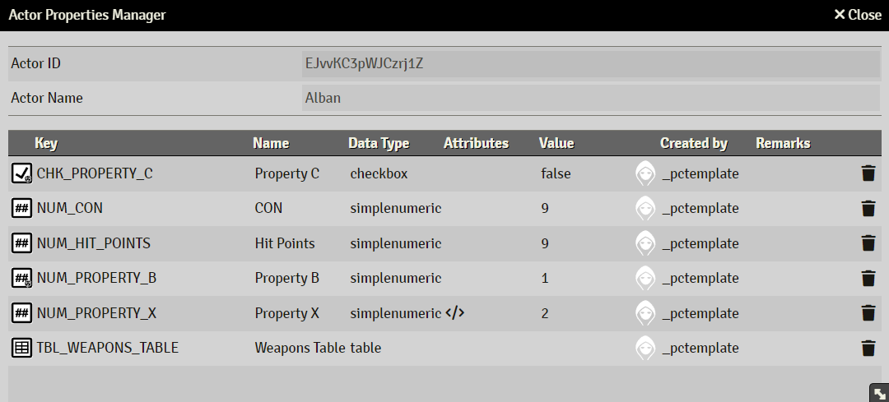
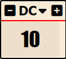
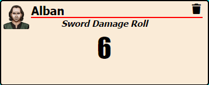

# Sandbox User Interface

This chapter describes various aspects of using a Sandbox world

## Sandbox Toolbar

On the Game Settings tab, the Sandbox Toolbar can be found. From here, you can access various system functions.

The toolbar is only showed for GMs.

For more information, see [Sandbox Toolbar](sandbox_toolbar.md)

## Sheets Title Bar

Sandbox adds three clickable captions to all items and actor sheets

### Icons(Show/Hide Delete/Add)

Shows/hides all delete icons on sheets, it also shows/hides the Add new row icon for free tables.

This is only shown if the setting **Activate item deletion protection** is enabled in [Settings](sandbox_settings.md)

### Show(Info to others)

This tool makes it easy to show other selected players/GMs an item/actor without needing giving ownership to that item/actor. 

#### Popup

#### Chat

#### Chat(compact)

### Info

This is only shown if the option **Display ID in sheet caption** is enabled in Sheet Options in [Settings](sandbox_settings.md)
It is only shown to GMs.

When clicked, it will output the item/actors data to the Console(press F12).

For actors, CTRL+Click will display the Actor Properties Manager for that actor

## Actor Properties Manager

The Actor Properties manager is a useful tool to remove obsolete properties and otherwise troubleshoot actor properties problems.

## Difficulty Class

If enabled in Settings, this will display a box with a Difficulty Class number, usable in expressions as #{diff}

If defined in Settings, the DC will have a dropdown with defined Difficulty Classes.

## Last Roll

If enabled in Settings, this will display a box with the last roll made

