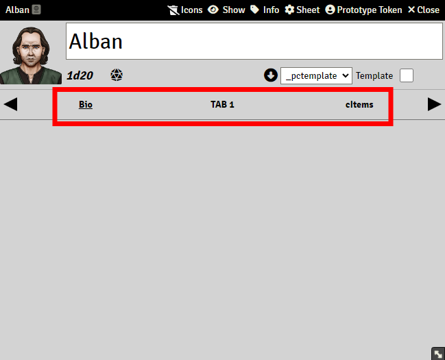
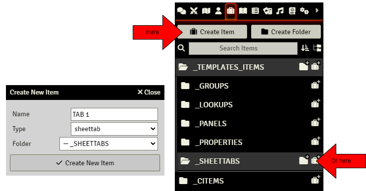
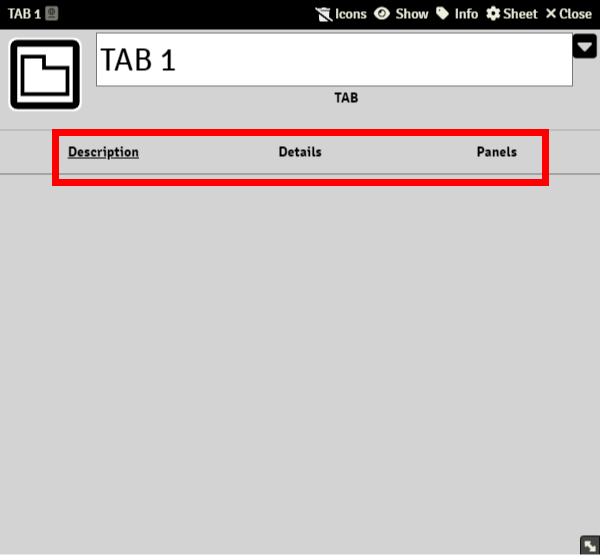
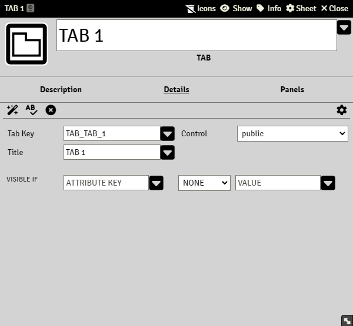
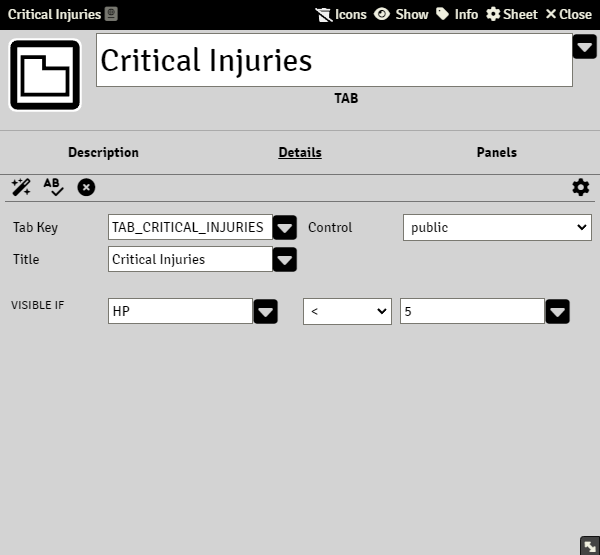
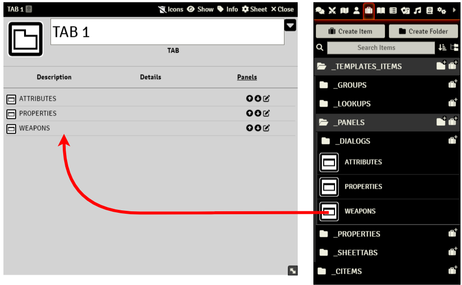

# Sheettabs

> These pages are under construction, if needed, please refer to the previous [README](readme_previous.md)

Sheettabs(often just referred to as 'tabs') are item elements that represent a unique page within an Actor sheet.
Every tab included in a Template Actor's tab list will be shown on the tabs ribbon:

Creating a Sheettab is very simple. Just press the "Create Item" Button and select "sheettab" from the list. Name it, and create it:

There are three different pages inside a Tab element window: Description, Details, and Panels.

#### Description menu

In this page you can add an informative description or summary of what the tab contains or includes. It is optional to do this, and does not interfere with the functioning of the element.

#### Details menu

This page contains a number of input fields that configures how the tab works.

#### Tab Key

Required field, it has to be filled for every tab, and it needs to be unique. If two or more tabs share the same key, then the template will not rebuild correctly and the system will throw many errors. A key is a word or a group of characters, without spaces/blanks. i.e: tab_one, tab_1, inventorytab, my-tab-3, etc. See [Keys](sandbox_keys.md)

#### Title

Required field, but does not need to be unique. This field will be displayed on the tabs ribbon of the actor sheet, and it can contain spaces.

#### Control

You can choose between public (everyone will be able to interact with the tab) or gamemaster (only the GM will see this tab)

#### Visible If

This option sets the visibility of the tab depending on the value of an actor property. Imagine you want a Tab that will display options for characters that are critically injured, and you only want it to be shown if the property HP has a value lower than 5. For this to work, you could set it like this:

**Panels menu**

Tab elements contain Panel and Multipanel elements. You can include a Panel into a Tab just by dragging it. All panels in a Tab will be sorted in the sheet based on this list order. You can change this order by clicking the up and down arrow icons:

