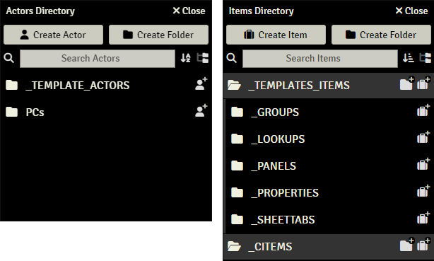

## System Structure

> These pages are under construction, if needed, please refer to the previous [README](readme_previous.md)

Every system in Sandbox depends on two things:

- A group of Template Actors
- A group of cItems

A Template Actor is a Foundry actor that lets you configure how character sheets will look like. All Foundry actors linked to a Template Actor will have the same look and information. This way we can have templates for player character sheets, for NPC sheets, for party treasure, etc. There is no limit to the number of templates a system can have. You will find more information on how to create and edit Template Actors on [here](template_actors.md). Template Actors hold Tabs, Panels and Properties.

A cItem is a Foundry Item that can be attached to an Actor and generate changes to its stats (properties generally). An example would be a chainmail armor cItem, that when dragged to an actor would modify its Armor Class property. cItems contain Groups and MODs. You will find more information on how to create and edit cItems on [here](citems.md).

A combination of templates and cItems is the basis of any Sandbox system. When preparing a system with Sandbox, special care is advised to organize the information on the directories. Our recommendation is to create a folder structure that helps with information storage, in the following way:

- A Folder for template actors in the Actors Directory.
- A Folder for Template Items (like Sheettabs, Panels, Properties, Groups, Lookups) within the Items Directory.
- A Folder for cItems within the Items Directory.

A suggestion for folder structure can look like this:

Folder structure is optional, there are no special requirements for the system to run. However, the Export System functionalities require a folder to export Sandbox content, so make sure that every element of your Sandbox system is contained in a folder.