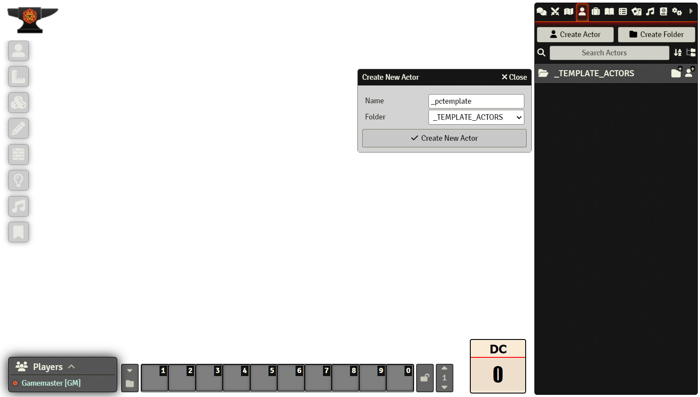
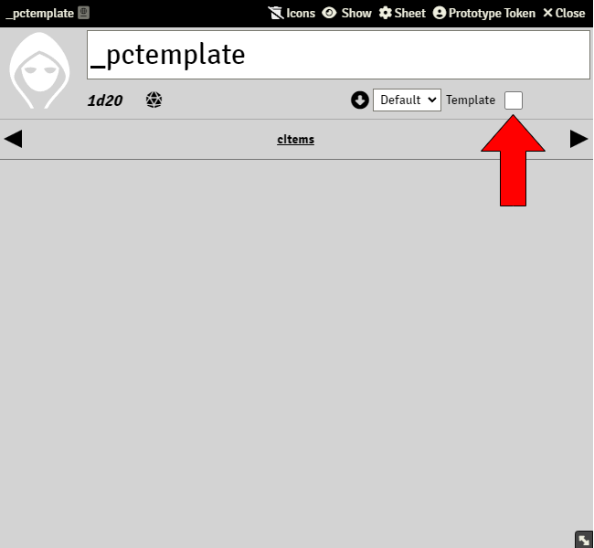
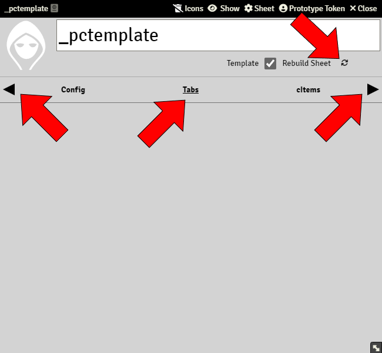
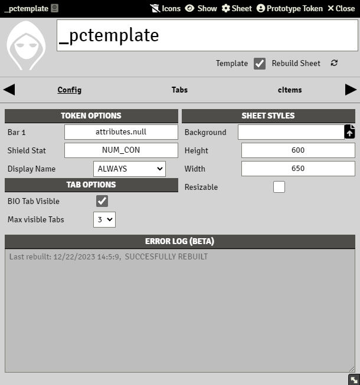

# Template Actors

> These pages are under construction, if needed, please refer to the previous [README](readme_previous.md)

A **Template Actor** is an actor that sets how a character sheet will look like, in terms of input fields, tab, panels, etc. You can have as many template actors as you want you could even have one for PC Sheets, another for NPC Sheets, another for Party Inventory, etc.

## Creating Template Actors

To create a Template Actor, just press on Create Actor on the Actors Directory menu, and create an actor like you would normally in any other Foundry system. A recommendation for Template Actors, is to name them without blank spaces:

This new actor is a blank Sandbox actor, but to make it a Template Actor you need to check the 'Template' below the character name:

Once this option is checked, the sheet will change. You will now have new Tabs, and a Rebuild Sheet button right of the Template checkbox. You can navigate between tabs by pressing the black triangles in the tabs section:

You can configure many template options from the Config tab:

### Token Options

Token Options let you configure what extra information will a token from an actor linked to this template will display when dragged to the canvas. In order for this section to work, you need to enable Token Options on the system configuration (see [Sandbox Setttings](sandbox_settings.md)):

### Sheet Styles

You can apply a custom look to the sheet on this section.

For more styling options, see [CSS and Styling](css_and_styling.css)

#### Background

The Background field can be populated with the path to an image, that will be applied to the sheet background. The path to the file needs to be Foundry base, i.e: worlds/worldnamefolder/image.jpg

#### Height

The Height input field states the maximum and initial height that the sheet will have. 

#### Width

The Widthinput field states the maximum and initial width that the sheet will have. 

#### Resizable

If the Resizable checkbox option is unchecked, the scaling tool at the bottom right of the sheet will be hidden, so the users won't be able to edit the sheets size.

### Tab Options

This section allows you to configure a couple of visual options for all sheets based on the template actor.

#### BIO Tab Visible

If BIO visible checkbox is selected, all character sheets based on this template actors will display a Tab called BIO, and will be shown as the first tab.

#### Max visible Tabs 

Sets the maximum number of tabs that are shown on the tabs ribbon at any time

### Error Log

Displays information for this actor templates last build.

## Building Template Actors

A Template Actor needs Tabs and/or cItems before it can be used as a template character sheet. You can read about how to do this in [Building Template Actors](template_actors_building.md)
