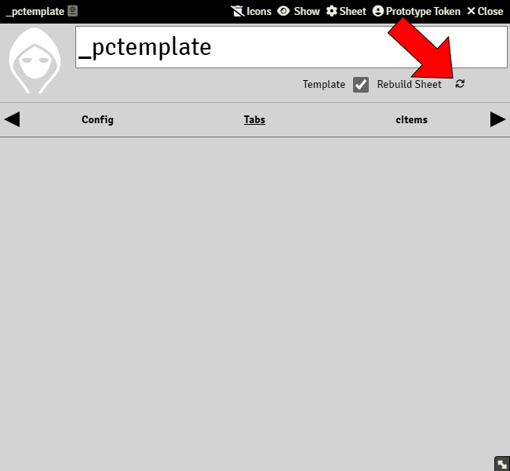
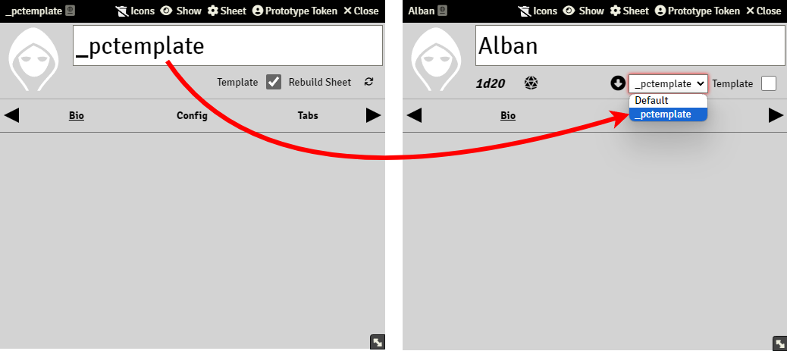
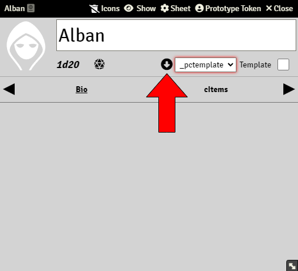

# Building Template Actors

Template Actors are the equivalent to blank character sheets, but unlike those you can't fill them. A Template Actor can never be a filled character sheet, only a reference for real character sheets.

A Template Actor needs to be rebuilt in order for it to be used as an empty character sheet for other actors. Every time an element included in a Template Actor's Tab is modified, the Template needs to be rebuilt for it to register the changes.

Template Actors can also be rebuilt using the **Build Actor Templates** command on the [Sandbox Toolbar](sandbox_toolbar.md)

Remember that Template Actors can only hold Tabs and/or cItems, so if you change a panel or a property that is included in a tab, you still need to rebuild the template actor.

Once your Template Actor is rebuilt, is ready to be used as a template for a character sheet. To do so, open an Actor sheet, and select the name of the template to use, right under the actor´s name field:

As mentioned before, editing a panel, tab, or property requires rebuilding the template, but if you don't see the change on the actor, you need to reload the template. Simply press the download icon left of the template selection list:

If you want a group of specific cItems to be added to every actor linked to the Template Actor, you need to drag them from the Items folders to the cItems tab of the template actor. This way, every Actor will have those cItems by default.